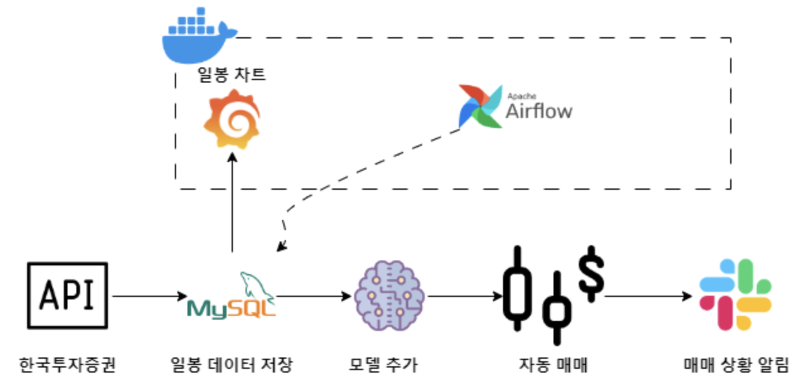

# TODO
- [x]  [민종님 깃허브](https://github.com/minjong3/Stock-price-prediction-service)기초로 아키텍쳐 구축
- [ ] Dockerizing
- [ ] DB 스키마 설계
- [ ] 한국투자증권 api 사용하여 일봉 데이터 가져오는 코드 작성
- [ ] 데이터 적재
- [ ] DS분들이 작성한 모델 탑재
- [ ] 시각화(Grafana)
- [ ] Airflow로 데이터 파이프라인 자동화
- [ ] 모델 백테스트 기능 추가

---
# 구축 메뉴얼
## Architecture

## Prerequirements
- [Kubernetes](kubernetes(k8s)%20HA%20구성%20설치.pdf)
- [Helm](https://helm.sh/docs/intro/install/)
## Install Components
### Grafana
```bash
helm repo add grafana https://grafana.github.io/helm-charts
helm install grafana grafana/grafana
```
### Airflow
```bash
helm repo add apache-airflow https://airflow.apache.org/
helm install airflow apache-airflow/airflow
```
### Flask
```bash
pip install flask
```
### MySQL
```bash
helm repo add bitnami https://charts.bitnami.com/bitnami
helm install mysql bitnami/mysql
```