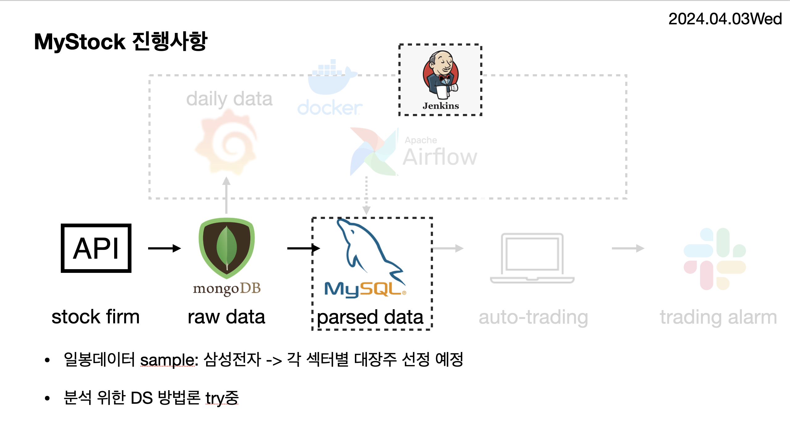

# TODO
- [x]  [민종님 깃허브](https://github.com/minjong3/Stock-price-prediction-service)기초로 아키텍쳐 구축
- [v] Dockerizing
- [v] DB 스키마 설계
- [v] 한국투자증권 api 사용하여 일봉 데이터 가져오는 코드 작성
- [v] 데이터 적재
- [v] jenkins 빌드 테스트 job 등록
- [ ] DS분들이 작성한 모델 탑재
- [ ] 시각화(Grafana)
- [ ] Airflow로 데이터 파이프라인 자동화
- [ ] 모델 백테스트 기능 추가

---
# 구축 메뉴얼
## Architecture

## Install Components

### Airflow
```bash
helm repo add apache-airflow https://airflow.apache.org/
helm install airflow apache-airflow/airflow
```
### Requirements
```bash
pip install -r requirements.txt
```

### Docker Images
```bash
docker pull mysql:latest
docker pull jupyter/scipy-notebook:latest
docker pull mongo:latest
docker pull jenkins/jenkins:lts-jdk17
docker pull apache/airflow:2.9.0
```

### Jenkins 사용 방법
- Jenkins 컨테이너에 python 3.11.8 설치
- Requirements 설치
- Jenkins 컨테이너 내부에 .env파일 작성 이후 Jenkins Job에 .env 경로 복사 쉘스크립트 추가